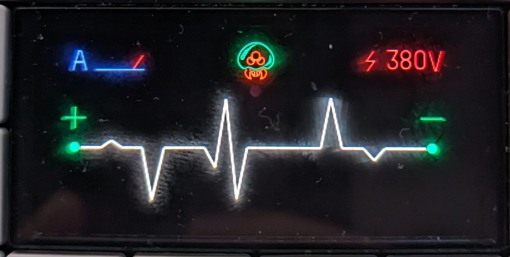

# op1-svg-haven
collection of custom op1 svgs!

## about
welcome to op1-svg-haven! this repo contains a collection of svg patches to apply for the op-1! since i cannot host original intellectual property, there are patch files to apply changes to the original svgs (which you can perhaps extract from some sort of firmware?).

## how to use

### prerequisites
make sure you have `diff-match-patch` installed. you can install it using pip:
```bash
pip install diff-match-patch
```

### generating a patch file
to generate a patch file, use the `generate_patch.py` script. this script requires the paths to the original svg file and the modified svg file.

#### command:
```bash
python generate_patch.py <original_file> <modified_file>
```

### applying a patch file
to apply a patch file, use the `patch_svg.py` script. this script requires the paths to the original svg file and the patch file.

#### command:
```bash
python patch_svg.py <original_file> <patch_file>
```

#### example:
```bash
python patch_svg.py slump.svg svg_patches/slump_metroid.svg.patch
```

## list of current patches

### slump_metroid
adds a lil cute metroid to the voltage synth!


### bode_fox
replaces the cow in the cwo effect with a fox :3


## disclaimer
this project is not affiliated with teenage engineering. all intellectual property rights for the original svg files remain with teenage engineering.

## contributing
if you would like to contribute, feel free to fork this repo and submit a pull request! please make sure that the resulting svg keeps the original op-1 vibes, especially in terms of colours and line width.

## helpful links
- [op1 svg information](https://github.com/sualk/op1-docs/blob/master/svg.md)

*happy modding!* :3
